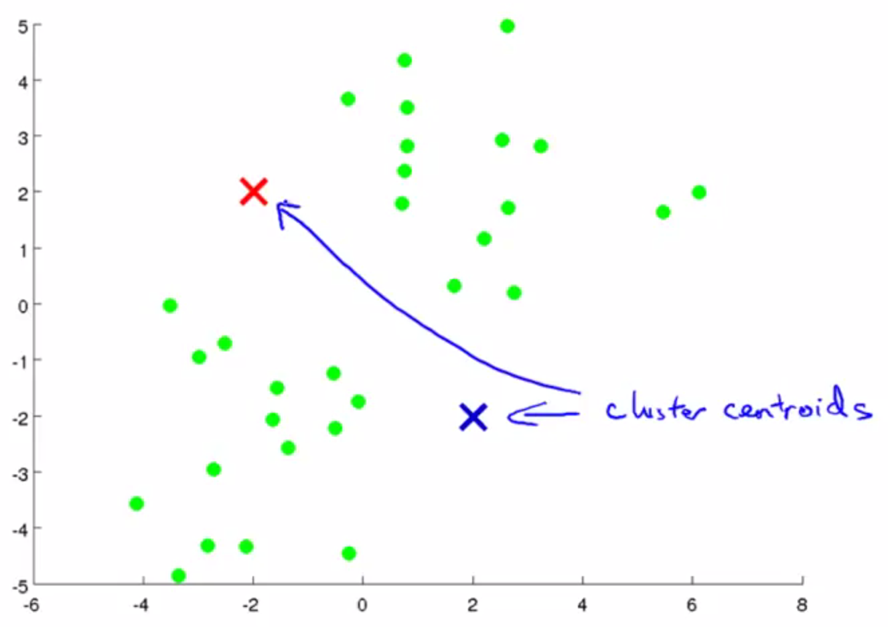
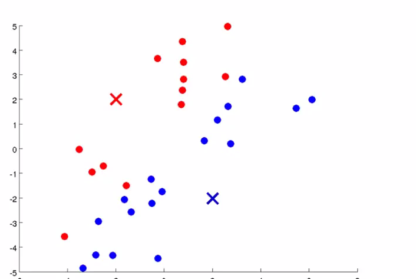
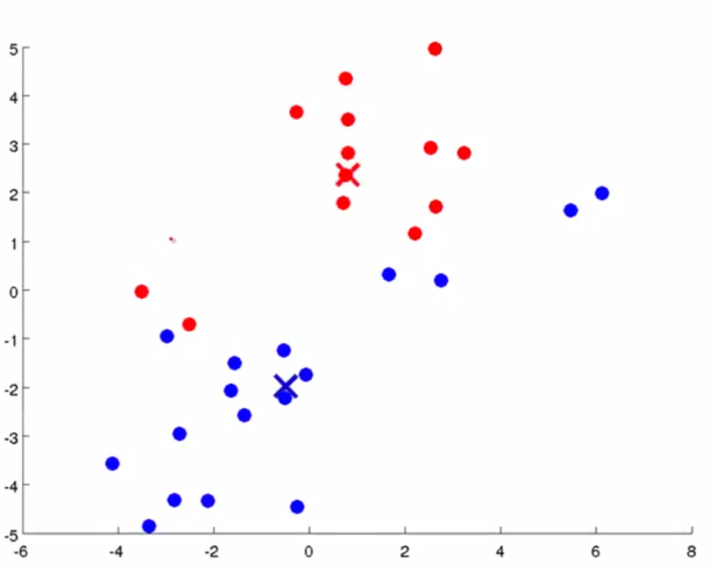

# K-Means算法步骤
那么，K-Means这个算法是如何完成聚类过程的呢？其实算法名称中对此已有体现：

- **K**: 描述了**簇**的数量，也就是应当聚合成的几何数。
- **Means**：**均值**求解会是该算法的核心。

## 步骤描述

下面具体看到该算法的步骤：

(1) 根据设定的聚类数$$K$$，随机地选择$$K$$个聚类中心（Cluster Centroid），这就好比古代乱世，天下诸侯并起而逐鹿

(2) 评估各个样本到聚类中心的距离，如果样本距离第$$i$$个聚类中心更近，则认为其属于第$$i$$簇，这可以看做四方义士纷纷投奔诸侯，形成不同的势力。

(3) 计算每个簇中样本的**平均（Mean）**位置，将聚类中心移动至该位置，该过程可以被认为是诸侯调整战略根据地以达到最强的控制力和凝聚力。

重复以上步骤直至各个聚类中心的位置不再发生改变。

综上，K-Means的算法步骤能够简单概括为：
1. 分配：样本分配到簇。
2. 移动：移动聚类中心到簇中样本的平均位置。

> 注意，某些聚类中心可能没有被分配到样本，这样的聚类中心就会被淘汰（以为着最终的类数可能会减少）。

## 伪码描述
- 假设簇的个数被定为$$K$$，样本数为$$m$$。
- 随机设定$$K$$个聚类中心：$$\mu_1,\mu_2,...,\mu_k \in R^n$$

重复如下过程直至聚类中心的位置不再改变：

**分配过程**

for $$i=1$$ to $$m$$：
$$
c^{(i)} = \mbox{距}x^{(i)}\mbox{最近的聚类中心} \quad c^{(i)}表示第i簇
$$
距离的计算式如下：
$$

\min_k||x^{(i)}-\mu_k||^2

$$
**移动过程**：

for $$k=1$$ to $$K$$：
$$

\mu_k(第k个聚类中心的新位置) = 第k簇的平均位置

$$假设$$\mu_2$$聚类中心下分配了$$4$$个样本：
$$

x^{(1)},x^{(5)},x^{(6)},x^{(10)}

$$

亦即：
$$

c^{(1)}=c^{(5)}=c^{(6)}=c^{(10)}=2

$$
那么$$\mu_2$$将会移动到这四个样本的中心位置：
$$

\mu_2=\frac{1}{4}(x^{(1)}+x^{(5)}+x^{(6)}+x^{(10)})

$$
