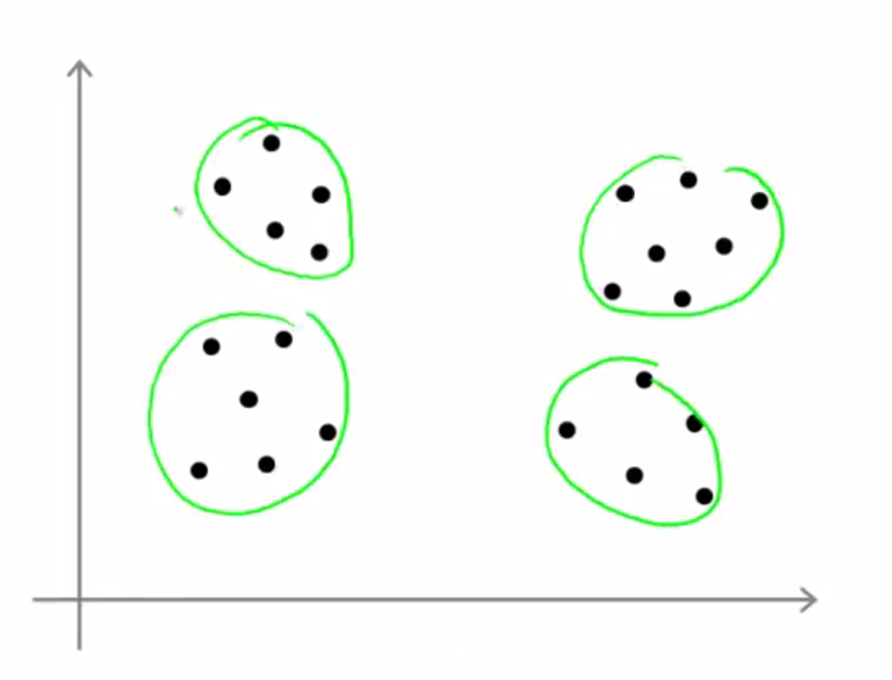
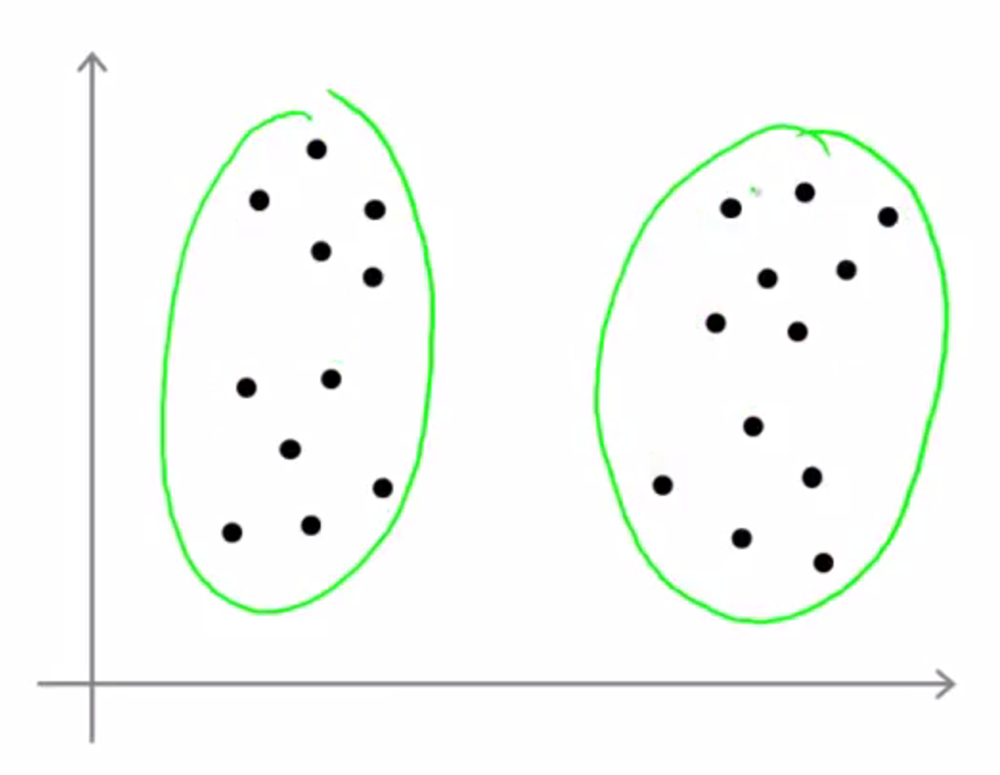
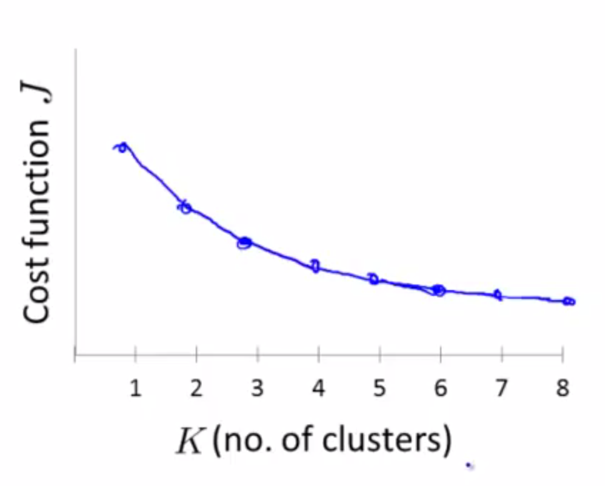

# 如何确定聚类数

实际上，一开始是很难确定聚类数的，下图的两种聚类数似乎都是可行的：

但是，也存在一种称之为**肘部法则（Elbow Method）**的方法来选定适当的K值：

上图曲线类似于人的手肘，“肘关节”部分对应的$$K$$值就是最恰当的$$K$$值，但是并不是所有代价函数曲线都存在明显的“肘关节”，例如下面的曲线：

一般来说，K-Means得到的聚类结果是服务于我们的后续目的（如通过聚类进行市场分析），所以不能脱离实际而单纯以数学方法来选择$$K$$值。在下面这个例子中，假定我们的衣服想要是分为 S,M,L 三个尺码，就设定 $$K=3$$ ，如果我们想要 XS,S,M,L,XL 5个衣服的尺码，就设定 $$K=5$$：

