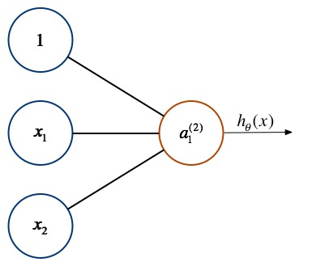

程序示例--逻辑运算
==============
我们使用感知器神经网络来描述逻辑AND运算：



代码：

```python
# coding: utf-8
# neural_network/test_logic_and.py
"""逻辑AND运算
"""
import nn
import numpy as np

data = np.mat([
    [0, 0, 0],
    [1, 0, 0],
    [0, 1, 0],
    [1, 1, 1]
])

X = data[:, 0:2]
y = data[:, 2]

res = nn.train(X, y,  hiddenNum=0, alpha=10, maxIters=5000, precision=0.01)
print 'Run %d iterations'%res['iters']
print 'Error is: %.4f'%res['error']
print 'Theta is: ', res['Thetas'][0]
```

程序运行结果如下：

```sh
Doing Gradient Checking....
Run 164 iterations
Error is: 0.0100
Theta is:  [[-12.99763241   8.55129742   8.55129749]]
```

可以看到，最终生成的权值矩阵如下：

$$

\Theta^{(1)} =
\left[
\begin{matrix}
-12.99763241 & 8.55129742 & 8.55129749 \\
\end{matrix}
\right]

$$

亦即，我们可以这样描述逻辑运算：

$$

\mbox{$x_1$ AND $x_2$} = sigmoid(8.55129742x_1+8.55129749x_2-12.99763241)

$$
