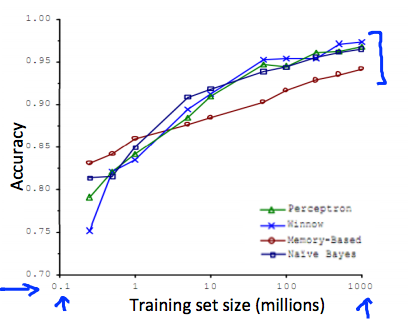

大数据集
================

在机器学习领域，流传着这样一句话：

> It's not who has the best algorithm that wins. It's who has the most data.

所以商业社会中，互联网公司都不遗余力地先收集一波大数据再说，没有数据，再多的手段也是空谈。下图中，是一个区分容易混淆单词的机器学习案例，所采用的几种算法在训练样本给的越来越多时，都表现的越来越优异：

什么时候采用大规模的数据集呢，一定要保证模型拥有足够的参数（线索），对于线性回归/逻辑回归来说，就是具备足够多的特征，而对于神经网络来说，就是更多的隐层单元。这样，足够多的特征避免了**高偏差**（欠拟合）问题，而足够大数据集避免了多特征容易引起的**高方差**（过拟合）问题。
