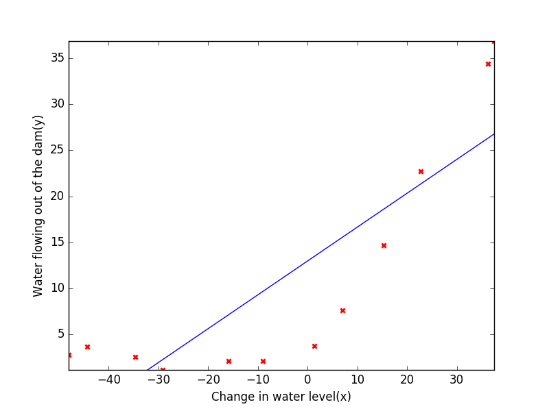
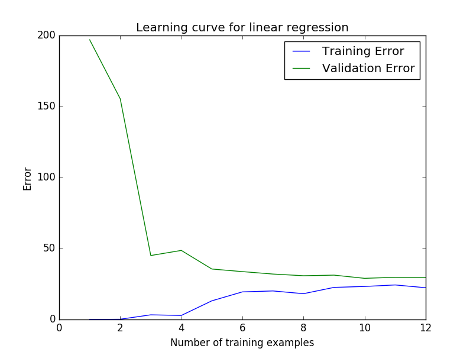
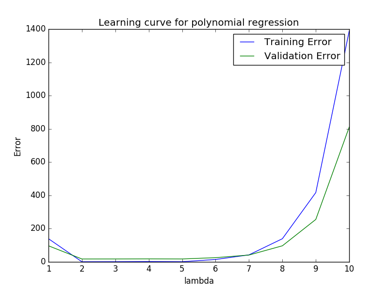
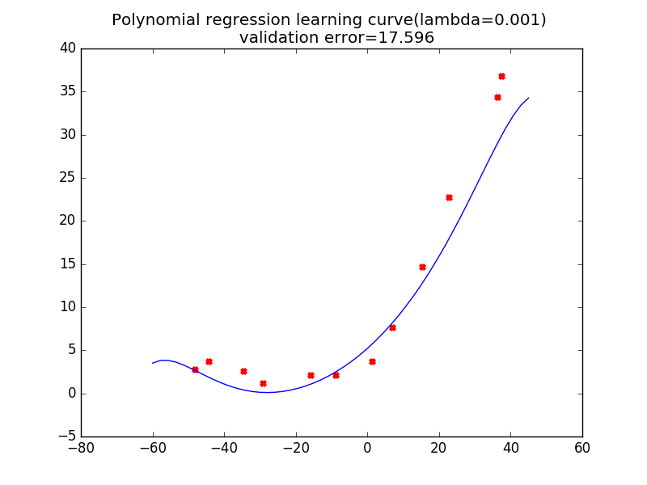

程序示例--算法诊断
==============

我们手头有一份大坝水的流量与水位关系的数据，首先我们将其划分为**训练集**、**交叉验证集**和**测试集**：

```python
# coding: utf-8
# algorithm_analysis/diagnose.py
"""算法诊断
"""
import linear_regression
import numpy as np
from scipy.io import loadmat
import matplotlib.pyplot as plt
from sklearn.preprocessing import PolynomialFeatures

data = loadmat('data/water.mat')
#####
# 数据集划分
#####
# 训练集
X = np.mat(data['X'])
# 为X添加偏置
X = np.concatenate((np.ones((X.shape[0], 1)), X), axis=1)
y = np.mat(data['y'])
# 交叉验证集
Xval = np.mat(data['Xval'])
Xval = np.concatenate((np.ones((Xval.shape[0], 1)), Xval), axis=1)
yval = np.mat(data['yval'])
# 测试集
Xtest = np.mat(data['Xtest'])
Xtest = np.concatenate((np.ones((Xtest.shape[0], 1)), Xtest), axis=1)
ytest = np.mat(data['ytest'])
```

接着，我们会使用训练集来获得线性回归的拟合曲线，并且观测**随样本大小$$m$$变化的学习曲线**：

```python
# algorithm_analysis/diagnose.py
def diagnoseLR():
    """线性回归诊断
    """
    initTheta = np.mat(np.ones((X.shape[1], 1)))
    result, timeConsumed = linear_regression.gradient(
        X, y, rate=0.001, maxLoop=5000, epsilon=0.1, initTheta=initTheta)
    theta, errors = result

    # 绘制拟合成果
    Xmin = X[:, 1].min()
    Xmax = X[:, 1].max()
    ymax = y[:, 0].max()
    ymin = y[:, 0].min()
    fitX = np.mat(np.linspace(Xmin, Xmax, 20).reshape(-1, 1))
    fitX = np.concatenate((np.ones((fitX.shape[0], 1)), fitX), axis=1)
    h = fitX * theta
    plt.xlim(Xmin, Xmax)
    plt.ylim(ymin, ymax)
    # 绘制训练样本
    plt.scatter(X[:, 1].flatten().A[0], y[:, 0].flatten().A[0],marker='x',color='r', linewidth=2)
    # 绘制拟合曲线
    plt.plot(fitX[:, 1], h, color='b')
    plt.xlabel('Change in water level(x)')
    plt.ylabel('Water flowing out of the dam(y)')
    plt.show()

    # 绘制随样本规模学习曲线
    m, n = X.shape
    trainErrors = np.zeros((1,m))
    valErrors = np.zeros((1,m))
    for i in range(m):
        Xtrain = X[0:i+1]
        ytrain = y[0:i+1]
        res, timeConsumed = linear_regression.gradient(
            Xtrain, ytrain, rate=0.001, maxLoop=5000, epsilon=0.1)
        theta, errors = res
        trainErrors[0,i] = errors[-1]
        valErrors[0,i] = linear_regression.J(theta, Xval, yval)

    plt.plot(np.arange(1,m+1).ravel(), trainErrors.ravel(), color='b', label='Training Error')
    plt.plot(np.arange(1,m+1).ravel(), valErrors.ravel(), color='g', label='Validation Error')
    plt.title('Learning curve for linear regression')
    plt.xlabel('Number of training examples')
    plt.ylabel('Error')
    plt.legend()
    plt.show()
```





通过观测学习曲线，我们估计算法出现了**高偏差（High Bias）**情况，因此，我们通过多项式回归来提高拟合精度：

```python
# algorithm_analysis/diagnose.py
def diagnosePR():
    """多项式回归诊断
    """
    # 多项式回归
    poly = PolynomialFeatures(degree=8)
    XX, XXval, XXtest = [linear_regression.normalize(
        np.mat(poly.fit_transform(data[:, 1:]))) for data in [X, Xval, Xtest]]
    initTheta = np.mat(np.ones((XX.shape[1], 1)))
    theLambdas = [1.0, 0.001, 0.003, 0.01, 0.003, 0.1, 0.3, 1.0, 3.0, 10.0]
    numTheLambdas = len(theLambdas)
    trainErrors = np.zeros((1, numTheLambdas))
    valErrors = np.zeros((1, numTheLambdas))
    thetas = []
    for idx, theLambda in enumerate(theLambdas):
        res, timeConsumed = linear_regression.gradient(
            XX, y, rate=0.3, maxLoop=500, epsilon=0.01,
            theLambda=theLambda, initTheta=initTheta)
        theta, errors = res
        thetas.append(theta)
        trainErrors[0, idx] = errors[-1]
        valErrors[0, idx] = linear_regression.J(
            theta, XXval, yval, theLambda=theLambda)
    bestLambda = theLambdas[np.argmin(valErrors)]
    theta = thetas[np.argmin(valErrors)]
    error = np.min(valErrors)

    # # 绘制随样本规模学习曲线
    plt.plot(np.arange(1, numTheLambdas + 1).ravel(),
             trainErrors.ravel(), color='b', label='Training Error')
    plt.plot(np.arange(1, numTheLambdas + 1).ravel(),
             valErrors.ravel(), color='g', label='Validation Error')
    plt.title('Learning curve for polynomial regression')
    plt.xlabel('lambda')
    plt.ylabel('Error')
    plt.legend()
    plt.show()

    # 绘制拟合曲线
    fitX = np.mat(np.linspace(-60, 45).reshape(-1, 1))
    fitX = np.concatenate((np.ones((fitX.shape[0], 1)), fitX), axis=1)
    fitXX = linear_regression.normalize(np.mat(poly.fit_transform(fitX[:, 1:])))
    h = fitXX * theta
    plt.title('Polynomial regression learning curve(lambda=%.3f) \n  validation error=%.3f' % (bestLambda, error))
    plt.scatter(X[:, 1].ravel(), y[:, 0].flatten().A[0], marker='x', color='r', linewidth=3)
    plt.plot(fitX[:, 1], h, color='b')
    plt.show()
```

由于多项式回归可能引起过拟合问题，因此我们还考虑了正规化，并且获得了随不同的正规化参数$$\lambda$$变化的学习曲线:



借此知道了在$$\lambda=0.001$$的时候，交叉验证集误差最小，此时我们绘制拟合曲线：


