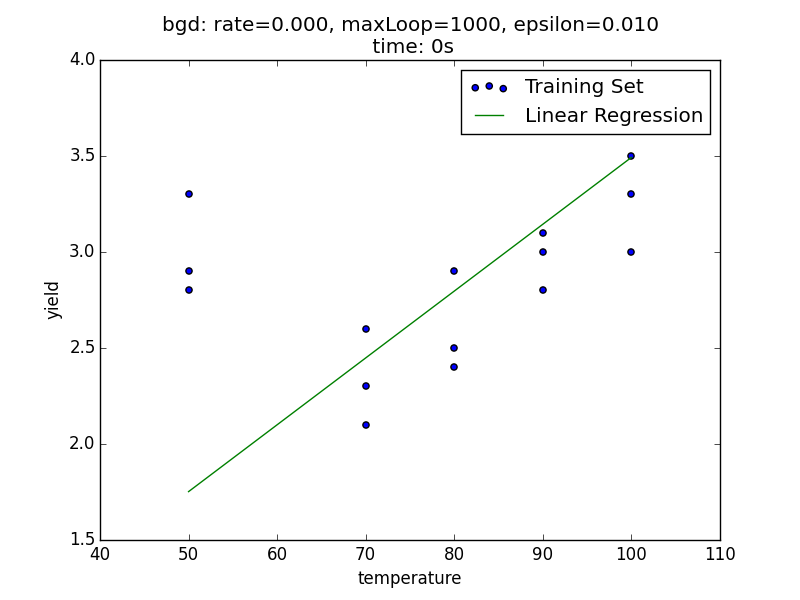

y# 程序示例，多项式回归
下面，我们有一组温度（temperature）和实验产出量（yield）训练样本，该数据来源于博客[Polynomial Regression Examples](https://onlinecourses.science.psu.edu/stat501/node/325)：

|temperature|yield|
|-----------|-----|
|         50|  3.3|
|         50|  2.8|
|         50|  2.9|
|	      70|  2.3|
|	      70|  2.6|
|	      70|  2.1|
|	      80|  2.5|
|	      80|  2.9|
|	      80|  2.4|
|	      90|  3.0|
|	      90|  3.1|
|	      90|  2.8|
|	     100|  3.3|
|	     100|  3.5|
|	     100|  3.0|

我们先通过如下预测函数进行训练：
$$

h(\theta) = \theta_0+\theta_1x

$$

```python
# coding: utf-8
import regression
from matplotlib import cm
from mpl_toolkits.mplot3d import axes3d
import matplotlib.pyplot as plt
import matplotlib.ticker as mtick
import numpy as np

if __name__ == "__main__":
    X, y = regression.loadDataSet('data/temperature.txt');

    m,n = X.shape
    X = np.concatenate((np.ones((m,1)), X), axis=1)

    rate = 0.0001
    maxLoop = 1000
    epsilon =0.01

    result, timeConsumed = regression.bgd(rate, maxLoop, epsilon, X, y)

    theta, errors, thetas = result

    # 绘制拟合曲线
    fittingFig = plt.figure()
    title = 'bgd: rate=%.3f, maxLoop=%d, epsilon=%.3f \n time: %ds'%(rate,maxLoop,epsilon,timeConsumed)
    ax = fittingFig.add_subplot(111, title=title)
    trainingSet = ax.scatter(X[:, 1].flatten().A[0], y[:,0].flatten().A[0])

    xCopy = X.copy()
    xCopy.sort(0)
    yHat = xCopy*theta
    fittingLine, = ax.plot(xCopy[:,1], yHat, color='g')

    ax.set_xlabel('temperature')
    ax.set_ylabel('yield')

    plt.legend([trainingSet, fittingLine], ['Training Set', 'Linear Regression'])
    plt.show()

    # 绘制误差曲线
    errorsFig = plt.figure()
    ax = errorsFig.add_subplot(111)
    ax.yaxis.set_major_formatter(mtick.FormatStrFormatter('%.4f'))

    ax.plot(range(len(errors)), errors)
    ax.set_xlabel('Number of iterations')
    ax.set_ylabel('Cost J')

    plt.show()
```

得到的拟合图像为：


接下来，我们使用了__多项式回归__，添加了2阶项：
$$

h(\theta) = \theta_0+\theta_1x+\theta_2x^2

$$

```python
# coding: utf-8
import regression
import matplotlib.pyplot as plt
import matplotlib.ticker as mtick
import numpy as np

if __name__ == "__main__":
    srcX, y = regression.loadDataSet('data/temperature.txt');

    m,n = srcX.shape
    srcX = np.concatenate((np.ones((m,1)), srcX[:, 0], np.power(srcX[:, 0],2)), axis=1)
    # 特征缩放
    X = regression.standardize(srcX.copy())

    rate = 0.1
    maxLoop = 1000
    epsilon = 0.01

    result, timeConsumed = regression.bgd(rate, maxLoop, epsilon, X, y)
    theta, errors, thetas = result

    # 打印特征点
    fittingFig = plt.figure()
    title = 'polynomial with bgd: rate=%.2f, maxLoop=%d, epsilon=%.3f \n time: %ds'%(rate,maxLoop,epsilon,timeConsumed)
    ax = fittingFig.add_subplot(111, title=title)
    trainingSet = ax.scatter(srcX[:, 1].flatten().A[0], y[:,0].flatten().A[0])

    print theta

    # 打印拟合曲线
    xx = np.linspace(50,100,50)
    xx2 = np.power(xx,2)
    yHat = []
    for i in range(50):
        normalizedSize = (xx[i]-xx.mean())/xx.std(0)
        normalizedSize2 = (xx2[i]-xx2.mean())/xx2.std(0)
        x = np.matrix([[1,normalizedSize, normalizedSize2]])
        yHat.append(regression.h(theta, x.T))
    fittingLine, = ax.plot(xx, yHat, color='g')

    ax.set_xlabel('Yield')
    ax.set_ylabel('temperature')

    plt.legend([trainingSet, fittingLine], ['Training Set', 'Polynomial Regression'])
    plt.show()

    # 打印误差曲线
    errorsFig = plt.figure()
    ax = errorsFig.add_subplot(111)
    ax.yaxis.set_major_formatter(mtick.FormatStrFormatter('%.2e'))

    ax.plot(range(len(errors)), errors)
    ax.set_xlabel('Number of iterations')
    ax.set_ylabel('Cost J')

    plt.show()
```

