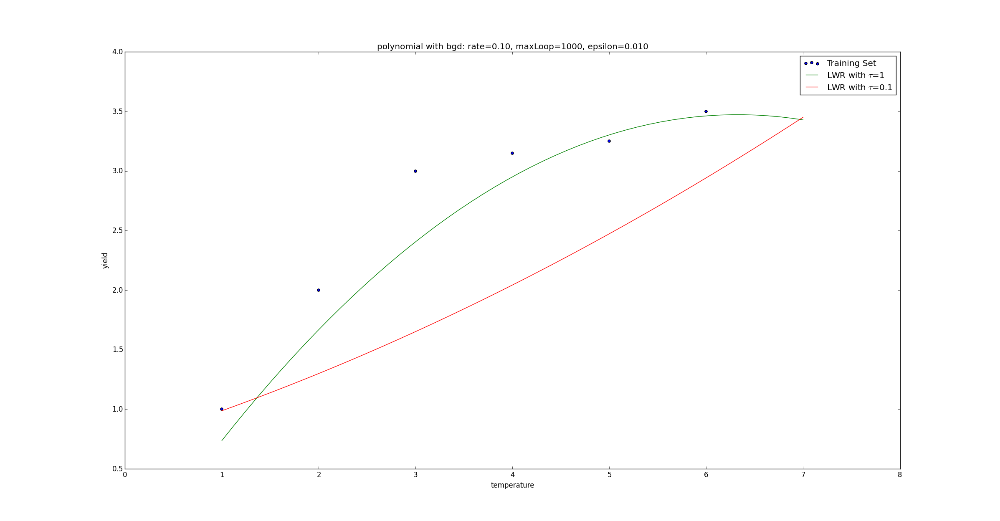

# 程序示例--局部加权线性回归
现在，我们在regression.py中又添加了`JLwr()`方法用于计算预测代价，以及`lwr()`方法用于完成局部加权线性回归：

```python
# regression.py

# ....

def JLwr(theta, X, y, x, c):
    """局部加权线性回归的代价函数计算式

    Args:
        theta: 相关系数矩阵
        X: 样本集矩阵
        y: 标签集矩阵
        x: 待预测输入
        c: tau
    Returns:
        预测代价
    """
    m,n = X.shape
    summerize = 0
    for i in range(m):
        diff = (X[i]-x)*(X[i]-x).T
        w = np.exp(-diff/(2*c*c))
        predictDiff = np.power(y[i] - X[i]*theta,2)
        summerize = summerize + w*predictDiff
    return summerize

@exeTime
def lwr(rate, maxLoop, epsilon, X, y, x, c=1):
    """局部加权线性回归

    Args:
        rate: 学习率
        maxLoop: 最大迭代次数
        epsilon: 预测精度
        X: 输入样本
        y: 标签向量
        x: 待预测向量
        c: tau
    """
    m,n = X.shape
    # 初始化theta
    theta = np.zeros((n,1))
    count = 0
    converged = False
    error = float('inf')
    errors = []
    thetas = {}
    for j in range(n):
        thetas[j] = [theta[j,0]]
    # 执行批量梯度下降
    while count<=maxLoop:
        if(converged):
            break
        count = count + 1
        for j in range(n):
            deriv = (y-X*theta).T*X[:, j]/m
            theta[j,0] = theta[j,0]+rate*deriv
            thetas[j].append(theta[j,0])
        error = JLwr(theta, X, y, x, c)
        errors.append(error[0,0])
        # 如果已经收敛
        if(error < epsilon):
            converged = True
    return theta,errors,thetas

# ...
```

__测试程序__：
```
# test/lwr.py

# coding: utf-8
import regression
import matplotlib.pyplot as plt
import matplotlib.ticker as mtick
import numpy as np

if __name__ == "__main__":
    srcX, y = regression.loadDataSet('data/lwr.txt');

    m,n = srcX.shape
    srcX = np.concatenate((srcX[:, 0], np.power(srcX[:, 0],2)), axis=1)
    # 特征缩放
    X = regression.standardize(srcX.copy())
    X = np.concatenate((np.ones((m,1)), X), axis=1)

    rate = 0.1
    maxLoop = 1000
    epsilon = 0.01

    predicateX = regression.standardize(np.matrix([[8, 64]]))

    predicateX = np.concatenate((np.ones((1,1)), predicateX), axis=1)

    result, t = regression.lwr(rate, maxLoop, epsilon, X, y, predicateX, 1)
    theta, errors, thetas = result

    result2, t = regression.lwr(rate, maxLoop, epsilon, X, y, predicateX, 0.1)
    theta2, errors2, thetas2 = result2


    # 打印特征点
    fittingFig = plt.figure()
    title = 'polynomial with bgd: rate=%.2f, maxLoop=%d, epsilon=%.3f'%(rate,maxLoop,epsilon)
    ax = fittingFig.add_subplot(111, title=title)
    trainingSet = ax.scatter(srcX[:, 0].flatten().A[0], y[:,0].flatten().A[0])

    print theta
    print theta2

    # 打印拟合曲线
    xx = np.linspace(1, 7, 50)
    xx2 = np.power(xx,2)
    yHat1 = []
    yHat2 = []
    for i in range(50):
        normalizedSize = (xx[i]-xx.mean())/xx.std(0)
        normalizedSize2 = (xx2[i]-xx2.mean())/xx2.std(0)
        x = np.matrix([[1,normalizedSize, normalizedSize2]])
        yHat1.append(regression.h(theta, x.T))
        yHat2.append(regression.h(theta2, x.T))
    fittingLine1, = ax.plot(xx, yHat1, color='g')
    fittingLine2, = ax.plot(xx, yHat2, color='r')

    ax.set_xlabel('temperature')
    ax.set_ylabel('yield')

    plt.legend([trainingSet, fittingLine1, fittingLine2], ['Training Set', r'LWR with $\tau$=1', r'LWR with $\tau$=0.1'])
    plt.show()

    # 打印误差曲线
    errorsFig = plt.figure()
    ax = errorsFig.add_subplot(111)
    ax.yaxis.set_major_formatter(mtick.FormatStrFormatter('%.2e'))

    ax.plot(range(len(errors)), errors)
    ax.set_xlabel('Number of iterations')
    ax.set_ylabel('Cost J')

    plt.show()
```

在测试程序中，我们分别对$$\tau$$取值$$0.1$$和$$1$$，得到了不同的拟合曲线：、


