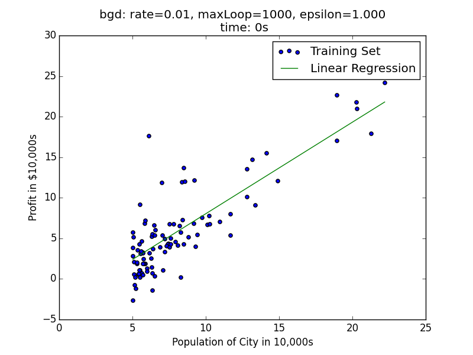

# 回归问题-程序示例
## 回归程序
下面我们将撰写程序，其中提供了__批量梯度下降__和__随机梯度下降__两种学习策略来求解回归方程：

```python
# coding: utf-8
import numpy as np
import time

def exeTime(func):
    """ 耗时计算装饰器
    """
    def newFunc(*args, **args2):
        t0 = time.time()
        back = func(*args, **args2)
        return back, time.time() - t0
    return newFunc

def loadDataSet(filename):
    """ 读取数据

    从文件中获取数据，在《机器学习实战中》，数据格式如下
    "feature1 TAB feature2 TAB feature3 TAB label"

    Args:
        filename: 文件名

    Returns:
        X: 训练样本集矩阵
        y: 标签集矩阵
    """
    numFeat = len(open(filename).readline().split('\t')) - 1
    X = []
    y = []
    file = open(filename)
    for line in file.readlines():
        lineArr = []
        curLine = line.strip().split('\t')
        for i in range(numFeat):
            lineArr.append(float(curLine[i]))
        X.append(lineArr)
        y.append(float(curLine[-1]))
    return np.mat(X), np.mat(y).T

def h(theta, x):
    """预测函数

    Args:
        theta: 相关系数矩阵
        x: 特征向量

    Returns:
        预测结果
    """
    return (theta.T*x)[0,0]

def J(theta, X, y):
    """代价函数

    Args:
        theta: 相关系数矩阵
        X: 样本集矩阵
        y: 标签集矩阵

    Returns:
        预测误差（代价）
    """
    result = 0.0
    m = len(X)
    for i in range(m):
        diff = pow(y[i,0] - h(theta, X[i].T), 2)
        result = result + diff
    return result/(2*m)

@exeTime
def bgd(rate, maxLoop, epsilon, X, y):
    """批量梯度下降法

    Args:
        rate: 学习率
        maxLoop: 最大迭代次数
        epsilon: 收敛精度
        X: 样本矩阵
        y: 标签矩阵

    Returns:
        (theta, error, iterationCount), timeConsumed
    """
    m,n = X.shape
    # 初始化theta
    theta = np.zeros((n,1))
    count = 0
    converged = False
    error = float('inf')
    while count<=maxLoop:
        if(converged):
            break
        count = count + 1
        for j in range(n):
            if(converged):
                break
            result = 0
            for i in range(m):
                diff = pow(y[i,0] - h(theta, X[i].T),2)*X[i,j]
                result =result + diff
            theta[j,0] = theta[j,0]+rate*result/m
             # 如果已经收敛
            error = J(theta, X, y)
            if(error < epsilon):
                converged = True
    return theta,error,count-1

# 定义随机梯度下降
@exeTime
def sgd(rate, maxLoop, epsilon, X, y):
    """随机梯度下降法

    Args:
        rate: 学习率
        maxLoop: 最大迭代次数
        epsilon: 收敛精度
        X: 样本矩阵
        y: 标签矩阵

    Returns:
        (theta, error, iterationCount), timeConsumed
    """
    m,n = X.shape
    # 初始化theta
    theta = np.zeros((n,1))
    count = 0
    converged = False
    error = float('inf')
    while count <= maxLoop:
        if(converged):
            break
        count = count + 1
        for i in range(m):
            if(converged):
                break
            diff = y[i,0]-h(theta, X[i].T)
            for j in range(n):
                theta[j,0] = theta[j,0] + rate*diff*X[i, j]
            # 如果已经收敛
            error = J(theta, X, y)
            if(error < epsilon):
                converged = True
    return theta, error, count-1
```

> 代码结合注释应该能看懂，借助于Numpy，只是复现了课上的公式。

## 测试程序
下面，我们分别对bgd和sgd进行测试，__学习率__，__最大迭代次数__都设置为一样，观测二者在误差收敛到$$0.005$$以下的运行状况。

### bgd测试
```python
import regression
import matplotlib.pyplot as plt

if __name__ == "__main__":
    X, y = regression.loadDataSet('data/ex0.txt');

    rate = 0.01
    maxLoop = 1000
    epsilon = 0.005

    result, timeConsumed = regression.bgd(rate, maxLoop, epsilon, X, y)
    theta,error,iterationCount = result

    fig = plt.figure()
    title = 'bgd: rate=%.2f, maxLoop=%d, epsilon=%.3f \n time: %ds'%(rate,maxLoop,epsilon,timeConsumed)
    ax = fig.add_subplot(111, title=title, )
    ax.scatter(X[:, 1].flatten().A[0], y[:,0].flatten().A[0])

    xCopy = X.copy()
    xCopy.sort(0)
    yHat = xCopy*theta
    ax.plot(xCopy[:,1], yHat)
    plt.show()
```




### sgd测试
```python
import regression
import matplotlib.pyplot as plt

if __name__ == "__main__":
    X, y = regression.loadDataSet('data/ex0.txt');

    rate = 0.01
    maxLoop = 1000
    epsilon = 0.005

    result, timeConsumed = regression.sgd(rate, maxLoop, epsilon, X, y)
    theta,error,iterationCount = result

    fig = plt.figure()
    title = 'sgd: rate=%.2f, maxLoop=%d, epsilon=%.3f \n time: %ds'%(rate,maxLoop,epsilon,timeConsumed)
    ax = fig.add_subplot(111, title=title, )
    ax.scatter(X[:, 1].flatten().A[0], y[:,0].flatten().A[0])

    xCopy = X.copy()
    xCopy.sort(0)
    yHat = xCopy*theta
    ax.plot(xCopy[:,1], yHat)
    plt.show()
```


可以看到，在该数据集（ex0.txt）中，sdg的运行速度卓越，仅耗时$$1s$$，是bgd的$$10$$倍以上。

> 数据来源[《机器学习实战》](https://www.manning.com/books/machine-learning-in-action)