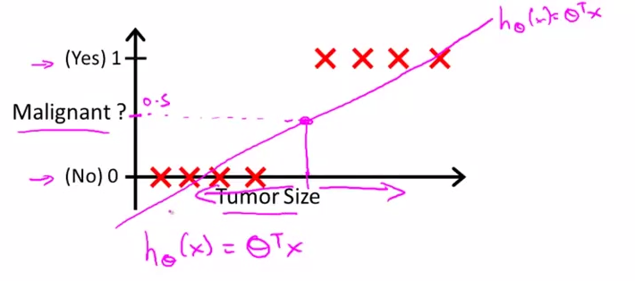
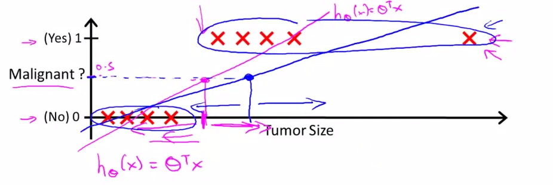

0-1分类问题
============

利用线性回归中的预测函数$$h_\theta (x)$$，我们定义阈值函数来完成0-1分类：

$$

h_\theta (x) \gt 0.5 => y=1 \\
h_\theta (x) \leq 0.5 => y=0

$$

下面两幅图都是完成的线性预测，在图1中，拟合曲线成功的区分了0、1两类，在图2中，如果我们新增了一个输入（右上的**X**所示），此时拟合曲线发生变化，由图1中的紫色线旋转到图2蓝色线，导致本应被视作1类的X被当做了0类。

另外，传统线性回归预测函数只是预测范围：

$$

h_\theta (x) \gt 1 \\
h_\theta (x) \lt 0

$$

综上，使用线性回归来处理0-1分类问题总是困难重重的，因此，人们定义了逻辑回归来完成0-1分类问题，逻辑一词也代表了**是（1）**和**非（0）**。
